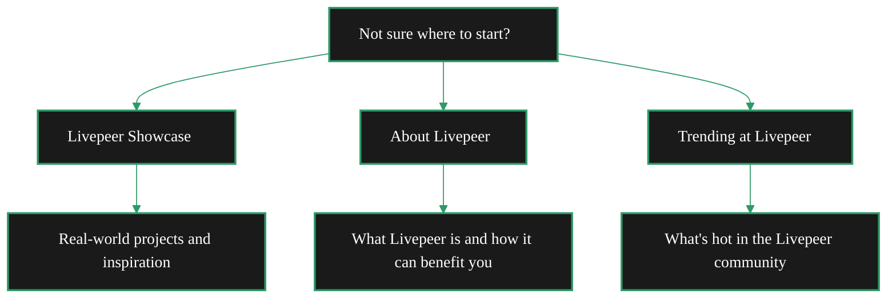

import { DisplayCard } from '/snippets/components/display/customCards.jsx'
import { LinkArrow } from '/snippets/components/primitives/links.jsx'

Not sure where to start? We've got you covered. Here's a guide to help you find what you're looking for.

### I'm new to Livepeer
<Columns cols={2}>

    <DisplayCard icon="eyes" title="Just Browsing">
            <LinkArrow label="Livepeer Showcase" href="../project-showcase/showcase" newline={false}  description="Check out real-world projects and get inspired." />
            <LinkArrow label="About Livepeer" href="../../00_home/introduction" description="Learn what Livepeer is and how it can benefit you." newline={false} />
            <LinkArrow label="Trending at Livepeer" href="../home/copy-trending-at-livepeer" description="See what's new across the Livepeer blog, forum, and socials." newline={false} />
    </DisplayCard>
    <DisplayCard icon="camera-movie" title="Real-time AI Video">
        <LinkArrow label="Stream Video Quickstart" href="../get-started/stream-video-quickstart" newline={false} description="Get started with Livepeer video streaming in minutes." />
        <LinkArrow label="Daydream" href="../../010_products/products/daydream/overview" newline={false} description="Real-time AI video creation." />
        <LinkArrow label="Livepeer Studio" description="Try out Livepeer Studio, a hosted video platform." newline={false} href="../../010_products/products/livepeer-studio/overview" />
    </DisplayCard>

</Columns>

{/* Just Browsing!

- [Livepeer Showcase](../project-showcase/showcase) - Check out real-world projects and get inspired.
- [About Livepeer](../../01_about/about-portal) - Learn what Livepeer is and how it can benefit you.

Want to use video AI in your project?

- [Livepeer AI Quickstart](../get-started/livepeer-ai-quickstart.mdx) - Get started with Livepeer AI in minutes.
- [Daydream](../03_developers/developer-platforms/daydream/daydream.mdx) - Learn more about Daydream, Livepeer's real-time AI video platform.
- [Platforms](../../010_products/products-portal) - Explore other Livepeer platforms and tools.

Want to stream or broadcast live video?

- [Stream Video Quickstart](../get-started/stream-video-quickstart.mdx) - Get started with Livepeer video streaming in minutes.
- [Livepeer Studio](https://livepeer.studio) - Try out Livepeer Studio, a hosted video platform.

Get more out of these docs:

- [Documentation Guide](../../07_resources/documentation-guide/style-guide) - Learn how to use these docs effectively.
- [Contribute to the Docs](../../07_resources/documentation-guide/contribute-to-the-docs) - Help improve these docs.

--- */}

### I'm a developer
<Columns cols={2}>

    <DisplayCard icon="wand-magic-sparkles" title="Integrate Video or AI">
        <LinkArrow label="Livepeer AI Quickstart" href="../get-started/livepeer-ai-quickstart.mdx" newline={false} description="Get started with Livepeer AI in minutes." />
        <LinkArrow label="Daydream" href="../../010_products/products/daydream/daydream" newline={false} description="Learn more about Daydream, Livepeer's real-time AI video platform." />
    </DisplayCard>
    <DisplayCard icon="microchip-ai" title="Custom AI Pipelines">
        <LinkArrow label="ComfyStream" href="../../03_developers/ai-inference-on-livepeer/ai-pipelines/comfystream" newline={false} description="Learn more about ComfyStream, Livepeer's AI pipeline platform." />
        <LinkArrow label="BYOC" href="../../03_developers/ai-inference-on-livepeer/ai-pipelines/byoc" newline={false} description="Bring Your Own Compute, Livepeer's custom AI pipeline platform." />
    </DisplayCard>
    <DisplayCard icon="building" title="Build a Business">
        <LinkArrow label="Developer Hub" href="../../03_developers/developer-portal" newline={false} description="Learn more about building on Livepeer." />
        <LinkArrow label="Gateways" href="../../04_gateways/gateways-portal" newline={false} />
        <LinkArrow label="Funding & Opportunities" href="../../03_developers/builder-opportunities/dev-programs" newline={false} description="Find Grants, RFPs & Other Opportunities." />
    </DisplayCard>

</Columns>

### I'm a GPU provider
<Columns cols={2}>

    <DisplayCard icon="server" title="Earn from Idle GPU">
        <LinkArrow label="Orchestrators" href="../../05_orchestrators/quickstart" newline={false} description="Learn more about running an orchestrator." />
    </DisplayCard>
    <DisplayCard icon="warehouse" title="Data Centre">
        <LinkArrow label="Contact" href="mailto:hello@livepeer.org" newline={false} description="Contact us for a chat." />
    </DisplayCard>

</Columns>

### I'm a user/creator
<Columns cols={2}>

    <DisplayCard icon="video" title="Stream or Broadcast">
        <LinkArrow label="Daydream" href="../../010_products/products/daydream/daydream" newline={false} description="Learn more about Daydream, Livepeer's real-time AI video platform." />
        <LinkArrow label="Stream Video Quickstart" href="../get-started/stream-video-quickstart.mdx" newline={false} description="Get started with Livepeer video streaming in minutes." />
        <LinkArrow label="Livepeer Studio" href="https://livepeer.studio" newline={false} description="Try out Livepeer Studio, a hosted video platform." />
    </DisplayCard>

</Columns>

### I'm an LPT holder
<Columns cols={2}>

    <DisplayCard icon="coins" title="Delegate LPT">
        <LinkArrow label="Delegators" href="../../06_lptoken/delegation/overview" newline={false} description="Learn more about delegating LPT." />
    </DisplayCard>
    <DisplayCard icon="check-to-slot" title="Vote">
        <LinkArrow label="Governance" href="../../06_lptoken/governance/overview" newline={false} description="Learn more about Livepeer governance." />
    </DisplayCard>

</Columns>

### I'm a company:
<Columns cols={2}>

    <DisplayCard icon="handshake" title="Use Livepeer in Your Product">
        <LinkArrow label="Partner" href="../../03_developers/building-on-livepeer/partners" newline={false} description="Learn more about Livepeer partners." />
        <LinkArrow label="Contact" href="mailto:hello@livepeer.org" newline={false} description="Contact us for a chat." />
    </DisplayCard>

</Columns>

### I'm a researcher
<Columns cols={2}>

    <DisplayCard icon="flask" title="Learn More About Livepeer">
        <LinkArrow label="Whitepaper" href="https://livepeer.org/whitepaper" newline={false} description="Learn more about the Livepeer network." />
        <LinkArrow label="Blog" href="https://blog.livepeer.org" newline={false} description="Read the latest news and articles about Livepeer." />
    </DisplayCard>

</Columns>

### Journey Map

