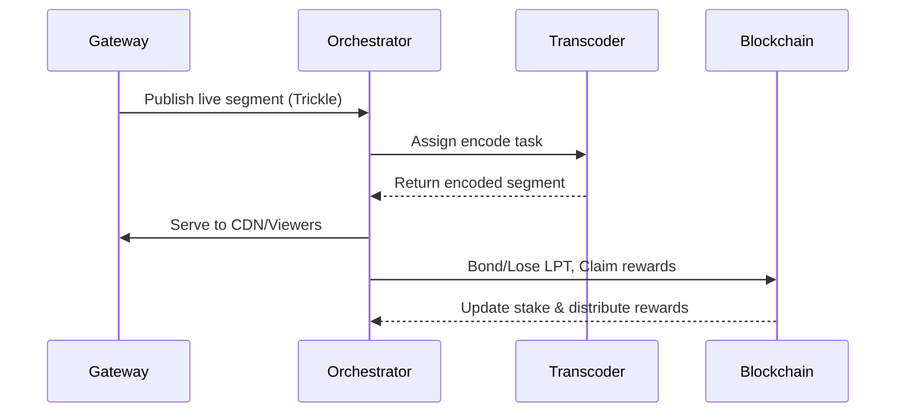

# Documentation Style Guide  
- Use clear, descriptive headings (`#`, `##`, etc.) to organize content. Each page should start with a **primary title** (H1) and use subheadings for sections.  
- Begin each page with an **Executive Summary** and an **ELI5** explanation before diving into details. This progressive structure helps different audiences (executives vs developers).  
- Keep paragraphs short (2–4 lines). Use bullet points or numbered lists to break down steps, key ideas, or parameters.  
- Highlight key figures and terms in **bold** (e.g., **100 LPT**, **33% quorum**). Use tables for comparisons or thresholds.  
- Include diagrams and flows using mermaid code blocks. For example, use `flowchart` or `sequenceDiagram` to illustrate architecture or processes. Provide descriptive captions or alt text for each diagram.  
- In **Layout & Media** sections, suggest images, GIFs, or charts. Reference them with descriptive captions (e.g. “*Diagram:* Livepeer streaming pipeline”). Indicate where interactive elements (expandable sections, tooltips) would improve clarity.  
- Maintain an **expository, explanatory tone**. Write as documentation for engineers and builders. Define all jargon (e.g. explain *“slashing”* or *“trickle protocol”*).  
- Use consistent terminology (e.g., “stake” vs “bond,” “on-chain” vs “off-chain”). Ensure numbers and acronyms are clear (explain APR, protocols, etc.).  
- Provide traceability: include a **Changes** or **Changelog** section listing how content was adapted (from the original doc or planning notes) to show improvements and sources.  

# Overview (Core Mechanism)  

## Executive Summary  
Livepeer is an open, decentralized live video streaming network. It uses **Broadcasters** (video publishers), **Orchestrators** (transcoding operators) and **Delegators** (token supporters) to process live video. The network runs in daily *rounds*, selecting the top-staked Orchestrators to handle work each round. After each round, rewards are distributed: newly minted LPT tokens (inflation) and collected ETH streaming fees are paid out to Orchestrators and their Delegators, based on stake and performance. 

Live video is streamed through the **Trickle** protocol, an HTTP-based segmented publish/subscribe pipeline: Gateways (broadcasters) POST video segments to Orchestrators, which transcode them, and the final video is delivered via standard CDNs or player protocols. Overall, Livepeer’s core mechanism ties together staking, token rewards, and off-chain video processing into one seamless video infrastructure.  

## ELI5 (Explain Like I'm 5)  
Imagine Livepeer as an Uber (or AirBnB) *for live video*.  
- **Broadcasters** are like riders: they have live video to stream.  
- **Orchestrators** are the drivers: they own computers (with GPUs) that encode and stream the video.  
- **Delegators** are helpers or investors: they give their tokens to back drivers they trust.  
Every day, Livepeer picks the best “drivers” based on how many tokens they and their supporters have staked. Those drivers do the video work, and in return **earn tokens and fees**. If a driver cheats (e.g. lies about doing work) or falls asleep on the job, they lose the tokens they staked.  

So, each day (a round), the network pays drivers and helpers based on how much video they helped with, using both new LPT tokens and the fees paid by broadcasters. This keeps everything fair: the more video you process (and the more stake you have), the more you earn.  

## Technical Details  

### Actors and Roles  
- **Gateway (Broadcaster):** Publishes live video segments to the network (using Trickle). Pays ETH fees for transcoding.  
- **Orchestrator (Node Operator):** Stakes LPT and competes for work. Runs transcoding nodes. Coordinates Transcoders (processors) to encode live video in real time. Earns LPT and ETH rewards for successful work.  
- **Transcoder:** The actual software (often GPU-accelerated) that encodes incoming segments into different video renditions. Controlled by an Orchestrator.  
- **Delegator (LPT Holder):** Stakes (delegates) LPT to an Orchestrator. Shares in the rewards and risk (slashing) of that Orchestrator. Even when delegating, they keep voting rights (delegated votes go to the Orchestrator).  

### Rounds and Rewards  
- **Round Duration:** ~1 day. At the end of each round, the network re-elects the set of active Orchestrators *purely by stake weight*.  
- **Work Selection:** In each round, only the top N staked Orchestrators (plus any designated reserve nodes) receive transcoding jobs. Others wait.  
- **Reward Distribution:** After the round, new LPT inflation and ETH fees collected from broadcasters are distributed. Payouts are *proportional to each node’s effective stake and performance* (nodes that did more work get more).  
- **Security (Slashing):** If an Orchestrator is dishonest (e.g. accepts jobs and doesn’t deliver correct results) or unresponsive, the protocol can slash its stake. The penalty is shared by the Orchestrator **and** all its Delegators. This ensures all players stay honest.  

### Streaming Pipeline  
Livepeer uses a **Trickle** protocol (HTTP-based) for live streaming:  
1. The Gateway encodes the live feed into **HLS/DASH segments**.  
2. The Gateway posts each segment to the network (Trickle service).  
3. Active Orchestrators **pull** these segments, transcode them (using FFmpeg, GPUs, etc.), and push encoded results.  
4. The final transcoded stream is delivered to viewers via CDNs (standard HTTP streaming to consumers).  

This pipeline is *off-chain*: video data never goes on Ethereum. Only token transfers, job assignments, and result attestations are on-chain.  

```mermaid
flowchart LR
  G([Gateway<br>(Broadcaster)]) -->|HTTP segments (Trickle)| O([Orchestrator])
  O -->|Transcoded video| CDN([CDN / Viewers])
  D([Delegator]) -->|Stake LPT to| O
  O -->|Earns<br>LPT + ETH| R[Rewards (LPT + ETH)]
```
*Figure: Livepeer streaming pipeline. Gateways send video to Orchestrators; Orchestrators encode and send video to consumers, earning LPT and ETH. Delegators stake tokens to Orchestrators.*

## Layout & Media Recommendations  
- **Hero Section:** Use a banner image or animation of a live video stream transforming (e.g., camera → GPU stack icon → screen). Overlay the tagline: *“Decentralized live video streaming powered by Web3.”*  
- **Key Diagrams:** Include a **protocol diagram** (like the mermaid flowchart above) showing Gateway, Orchestrator, Delegator, and token flows. Optionally animate it as a GIF (showing data moving).  
- **Bullet Lists / Icons:** Present roles (Broadcaster, Orchestrator, Delegator) as icon+text cards. Present the round cycle as numbered steps or a simple timeline graphic.  
- **Charts:** A small pie chart or progress bar showing current network stake ratio (e.g., 44% staked vs 56% unstaked).  
- **Media:** Consider embedding a short illustrative video or GIF of a live stream example, or a schematic of segment processing. Each image or animation should have a descriptive alt text (e.g. *“Diagram: Livepeer streaming pipeline”*) for accessibility.  

## Accessibility & Readability  
- Write in plain language for a broad audience, with a professional but friendly tone. Define terms (e.g. “slashing”) upon first use.  
- Use short paragraphs (2–3 lines) and bullet points for clarity.  
- Use headings and subheadings (as above) to break content.  
- Ensure diagrams have clear labels and captions. Provide alt text for images.  
- Use progressive disclosure: start with the big picture (Executive Summary), then the details.  

## Changes (from original doc & canvas)  
- Added an **Executive Summary** section summarizing core protocol goals.  
- Introduced an **ELI5** section with a relatable metaphor (Uber for video).  
- Reorganized content into clear subsections (Actors, Rounds, Pipeline) rather than a single paragraph.  
- Expanded on the streaming pipeline (Trickle) and role definitions for clarity.  
- Included a **mermaid diagram** for visual explanation of the flow.  
- Suggested layout improvements (hero image, icons, charts) based on planning notes.  
- Emphasized key points (e.g. stake/security) in bullet form for readability.  
- Clarified that video data is off-chain (protocol design) to avoid confusion.  

# Governance Model  

## Executive Summary  
Livepeer’s governance is fully **on-chain** and stakeholder-driven. Any LPT holder can propose protocol changes or treasury spending by staking 100 LPT. All **staked** LPT (including Delegators via their Orchestrators) can vote on proposals. Votes last for 30 rounds (~30 days). For a proposal to pass, at least 33% of all staked tokens must participate (quorum), and a majority (>50%) of votes must be in favor. If a proposal passes, the change is executed automatically by the smart contracts. This means **the community (token holders) collectively controls upgrades and spending**, with the protocol enforcing the outcome.  

## ELI5 (Explain Like I'm 5)  
Imagine a community garden run by people who own shares (tokens).  
- **Proposing a Change:** If someone has 100 share tokens, they can suggest a new rule (like “we should plant carrots”). They put 100 tokens in a safe place while the idea is considered.  
- **Voting:** Over the next month (30 days), everyone with tokens decides yes or no. If at least 33 out of every 100 token shares vote, and more than half vote “yes,” the idea becomes official. The 100 tokens go back to the proposer.  
- **Delegating Votes:** If you’ve given your shares to a friend to manage (delegation), you still get to vote because your votes travel with your shares.  
So basically, rules are set by token holders: stake some tokens to propose, everyone votes, and a rule only passes if enough people say yes.  

## Technical Details  

### Proposal Process  
- **Bond:** To submit a proposal, the proposer **bonds 100 LPT** with the Governor contract (this bond is returned if the proposal passes). This prevents spam proposals.  
- **Discussion:** Ideas are often discussed off-chain (e.g. on the Livepeer forum or GitHub LIPs) before going on-chain.  
- **Voting Period:** Once on-chain, the proposal is open for **30 rounds** (~30 days). Any staked LPT can vote. Orchestrators automatically cast votes for themselves and the Delegators who have delegated to them. Delegators’ votes effectively travel with their Orchestrator’s vote.  

### Voting & Thresholds  
- **Quorum:** At least **33% of all staked LPT** must vote (yes or no) for a vote to be valid (i.e. not fail due to low participation).  
- **Majority:** If quorum is met, the proposal passes if **>50% of votes** are “yes.”  
- **Automatic Execution:** If the vote passes, the Governor contract automatically executes the proposal’s encoded instructions on-chain. (No further action or approval is needed.)  

### Actor Flow  
```mermaid
flowchart TD
  P[Proposer (100 LPT bond)] -->|Submit proposal| GOV[Governor Contract]
  Orch[Orchestrator] -->|Vote yes/no (with delegated LPT)| GOV
  D[Delegator] -->|Votes via Orchestrator| Orch
  GOV -->|If passed| EXEC((Execute Proposal))
```
*Figure: Governance flow. Proposers stake 100 LPT to submit. Orchestrators (with delegated stake) vote. If quorum and majority are met, the proposal is executed.*  

### Treasury Governance  
The same governance rules apply for Treasury spending proposals. If a proposal to spend from the Treasury is approved under these thresholds, the funds are automatically released (see Treasury page). Livepeer uses a Compound-style Governor (customized for Livepeer) to manage both protocol upgrades and treasury spending.  

## Key Parameters  
| Parameter             | Value                                    |
|-----------------------|------------------------------------------|
| **Proposal bond**     | 100 LPT                                  |
| **Voting period**     | 30 rounds (~30 days)                     |
| **Quorum**            | 33% of all staked LPT                    |
| **Approval**          | >50% of votes cast (if quorum met)       |
| **Delegation**        | Delegated tokens vote via Orchestrator   |

## Layout & Media Recommendations  
- **Threshold Table:** Display the key governance parameters (as above) in a table or infographic.  
- **Process Flowchart:** Create a step-by-step diagram (e.g. mermaid sequence) for making a proposal and voting.  
- **FAQs or Callouts:** Emphasize that *delegating does not remove voting power*: Delegators still participate via their Orchestrators.  
- **Media:** Use icons (e.g. voting ballots, gavel, handshake) to illustrate proposals and votes. Consider a hero image of a community meeting or stylized ballot box.  

## Accessibility & Readability  
- Use simple language to explain thresholds and roles. For instance, explain *“quorum”* as “minimum participation needed.”  
- Present critical numbers (100 LPT, 33%, 50%) in bold or highlighted text.  
- Use bullet lists for the proposal steps and key rules.  
- Ensure tables have clear headers and labels (as above).  

## Changes (from original doc & canvas)  
- Separated **Rounds** from governance, focusing this page on proposals and voting.  
- Added **Executive Summary** and **ELI5** sections for clarity.  
- Tabulated governance parameters (proposal bond, quorum, etc.) as suggested.  
- Included a mermaid diagram to clarify proposal flow.  
- Clarified delegation: explicitly noted that delegators still vote via their Orchestrators.  
- Emphasized automatic execution and open rules.  
- Streamlined language and converted original prose into bullet points and tables for readability.  

# Livepeer Token (LPT)  

## Executive Summary  
Livepeer Token (LPT) is the native proof-of-stake token of the Livepeer network. LPT is used for **staking, securing the network, and governance**. Operators (Orchestrators) bond LPT to run transcoding services; Delegators stake LPT to support operators they trust. Staked LPT earns inflationary rewards (new LPT) and a share of ETH fees, while also carrying voting power in governance. Notably, **LPT is not used to pay video streaming fees**—broadcasters pay fees in ETH to Orchestrators.  

Unlike many projects, Livepeer had **no ICO**; the initial 10 million LPT supply was distributed via a community “Merkle Mine.” Today (early 2025) the supply has grown to ~38 million LPT (via inflation rewards). The protocol aims to maintain around 50% of tokens staked. In practice, only staked tokens receive inflation, so yields for stakers can be high when stake is low. For example, in early 2025 the inflation rate was ~25.6% per year, which translated to an effective ~58% APR for those tokens that were staked.  

## ELI5 (Explain Like I'm 5)  
Think of LPT as the **membership key** for Livepeer:  
- You need it to join and earn in the Livepeer system.  
- If you hold LPT, you can *rent out your GPU* (run or support video processing) or vote on network rules.  
- You don’t use LPT to watch videos — paying for streaming is done in ETH, not LPT.  
- Over time, the network prints new LPT (adds to the money supply) to reward people who help run it. Those who have put their LPT into the system (staked) get extra tokens.  

In short, LPT is like the loyalty token for Livepeer operators, not a currency for buying content.  

## Technical Details  

### Utility & Uses  
- **Staking:** LPT must be staked (bonded) in the protocol via the BondingManager contract to operate as an Orchestrator or to delegate.  
- **Governance:** Any staked LPT can vote on proposals. Delegators’ votes are cast via their chosen Orchestrator.  
- **Security:** The protocol is secured by stake. If an Orchestrator misbehaves, its staked LPT (and its Delegators’) can be slashed.  
- **Transactional Use:** LPT is *not* used to pay streaming fees. Broadcasters pay fees in ETH, which go to Orchestrators.  

### Supply & Distribution  
- **Initial Supply:** 10,000,000 LPT at genesis (2018), distributed via Merkle Mine (no ICO or pre-mine).  
- **Current Supply:** ~37,900,000 LPT (as of early 2025) – all additional supply comes from the protocol’s inflationary rewards.  
- **Inflation Model:** The protocol dynamically mints new LPT. If the percentage of tokens staked falls below 50%, inflation **increases** to attract more stakers. If staking is above 50%, inflation **decreases**.  
  - *Example:* In early 2025, ~44% of LPT was staked. The inflation rate was ~25.6% APR. Since only 44% of tokens were earning inflation, this meant stakers saw about 25.6% / 0.44 ≈ 58% effective APR on their staked LPT.  
- **Staked vs Unstaked:** Roughly 44% of LPT is staked (June 2025). The rest (56%) is freely tradable/unbonded. Only the staked portion earns inflation rewards.  
- **Arbitrum L2:** Livepeer’s contracts (including the LPT ERC-20) run on Ethereum’s Arbitrum network for lower gas fees.  

### Actor Flow  
```mermaid
flowchart LR
    D([Delegator (LPT Holder)]) -->|Stake LPT to| O([Orchestrator])
    O -->|Runs Transcoding| Process((Off-chain Video Service))
    O -->|Earn LPT Rewards| D
    O -->|Earn LPT Rewards| O
    FeePaid([ETH Fees from Broadcasters]) -->|Paid to| O
    subgraph TokenFlow
       LPTContract[[LPT Token (ERC-20)]]
    end
    LPTContract -->|Mint on inflation| O
    LPTContract -->|Claim rewards| D
```
*Figure: LPT staking and reward flow. Delegators stake LPT with an Orchestrator; both receive rewards. ETH fees go directly to Orchestrators.*  

## Layout & Media Recommendations  
- **Metrics Table:** Summarize key token stats in a table: genesis supply, current supply, target stake %, current stake %, inflation rate, effective yield.  
- **Pie/Bar Chart:** Illustrate **staked vs unstaked LPT** (e.g. “44% staked, 56% free”).  
- **Info Cards:** Brief callouts for important facts:
  - *“No ICO: started with 10M LPT”*,
  - *“On Arbitrum L2 for lower fees”*,
  - *“Staked LPT earn rewards (~58% APR in 2025 example)”*.  
- **Media:** Consider a timeline image showing token supply growth over years, or a code snippet showing the original Merkle distribution.  
- **Illustrations:** Use icons for “Stake”, “Governance vote”, “Rewards” next to explanatory text.  

## Accessibility & Readability  
- Bold key numbers and terms (e.g. *10,000,000 LPT*, *58% APR*).  
- Define finance terms simply (e.g. “APR” as annual rate).  
- Use consistent phrasing (don’t mix “stake” and “bond” without explanation).  
- Ensure tables or charts are clearly labeled and easy to read.  

## Changes (from original doc & canvas)  
- Combined supply and inflation info into clear bullet points.  
- Clarified that LPT is used for staking/governance, not for paying fees (explicit callout).  
- Added ELI5 analogy about LPT usage (from planning).  
- Inserted a mermaid flowchart to illustrate staking and rewards.  
- Included a table/chart suggestion for staked vs total (canvas idea).  
- Emphasized key figures (current supply, stake %, inflation) in text and tables.  
- Noted deployment on Arbitrum L2 (from PDF note).  

# Protocol Economics  

## Executive Summary  
Livepeer’s economics balance **inflationary rewards** with **real usage fees** to secure the network and reward participants. Early on, inflation (new LPT) bootstrapped security by incentivizing staking. Over time, as the network grows, more rewards come from actual fees paid by broadcasters (in ETH). The protocol targets ~50% of tokens staked: if staked <50%, inflation rises; if >50%, inflation falls. 

For example, in early 2025 the network had ~44% of LPT staked, so inflation was around 25.6% per year. Only the staked tokens received these new LPT, yielding an effective *~58% APR* for stakers (25.6% ÷ 0.44). Meanwhile, usage is growing quickly: Livepeer transcoded **~52 million minutes** of video in Q1 2025 (up 49% Q/Q) and saw record ETH fee revenue. These trends suggest Livepeer’s value is increasingly driven by real demand (ETH fees) rather than just token printing. 

## ELI5 (Explain Like I'm 5)  
Think of the network like a new theme park under construction:  
- Early on, the park gave out lots of *free tickets* (LPT tokens) to attract ride operators (to secure the park).  
- But as more people start riding rides (real demand), the park collects actual entrance fees (ETH).  
- If not enough operators join, the park gives out more free tickets. If many operators join, the park prints fewer.  
By 2025, people are riding a lot, so the park is earning real fees. Eventually, those fees (ETH) could pay workers more than the free tickets do.  

## Technical Details  

### Inflation vs Fees  
- **Staking Target (50%):** The protocol aims for ~50% of all LPT staked. If staked percentage < 50%, inflation **increases**; if > 50%, inflation **decreases**.  
- **Inflation Rate:** Adjusted each round by protocol logic (on-chain). Approximate example:  
  - *Example:* With ~44% staked, inflation was ~25.6% APR in early 2025.  
  - Only 44% of tokens earned those new LPT, so effective yield ≈ 25.6% / 0.44 ≈ **58% APR** for stakers.  
- **Usage Fees:** Broadcasters pay ETH fees to Orchestrators for streaming. Those ETH fees are collected by the protocol and distributed each round. Over time, as usage grows, ETH rewards form a larger share of total issuance.  
  - *Key Metric:* Q1 2025 saw **~52 million minutes** transcoded (up 49% Q/Q)【6†L1-L3】, with record ETH fee revenue.  

### Economic Flow  
```mermaid
flowchart LR
    fees[ETH Fees<br>(from Broadcasters)] -->|Paid to| OR([Orchestrator])
    inflation[LPT Inflation] -->|Minted to| OR
    OR -->|Shares LPT with| D([Delegator])
    subgraph Rewards
        OR -- Earns LPT & ETH --> OR
        D -- Earns share of LPT --> D
    end
```
*Figure: Rewards flow. Orchestrators earn both LPT (inflation) and ETH (fees). Delegators receive a share of the LPT earned by their Orchestrator.*  

- **Long-Term Transition:** The goal is for usage fees (ETH) to contribute significantly to node rewards, reducing reliance on token inflation. As the network’s activity grows, ETH fees will naturally increase. 

## Layout & Media Recommendations  
- **Chart:** A two-line chart showing *inflation rate (%)* and *stake ratio (%)* over time. (E.g., inflation falls as staking rises.)  
- **Key Metrics Block:** Highlight the "52M minutes (Q1 2025)" and "49% growth" in a callout or infographic.  
- **Table:** Example stake vs. inflation:

  | Staked % | Inflation APR | Effective APR (to stakers) |
  |---------:|--------------:|---------------------------:|
  | 50%      | target (e.g. 20%)* | 40% |
  | 44%      | 25.6%         | ~58%                      |
  | 70%      | lower (e.g. 10%)*   | ~14% |

  *Values marked “target” or estimates for illustration.*  
- **Flow Diagram:** Use the mermaid above for reward flows.  
- **Media:** Possibly an animated bar graph of usage minutes or ETH fees over recent quarters.  

## Accessibility & Readability  
- Spell out percentages and explain calculations (e.g., “25.6% per year (~58% APR)”).  
- Keep math simple and annotate (we divided 25.6 by 0.44 above).  
- Use color or labels in charts (e.g. blue for inflation, green for staking) and include a legend.  
- Define terms like “APR” (annual rate) and “inflation” in plain language.  

## Changes (from original doc & canvas)  
- Explicitly separated **inflation** vs **usage fees** and provided narrative context (canvas idea).  
- Added concrete example calculation for yield (from original numbers).  
- Incorporated the Q1 2025 usage stat (from PDF) into the summary.  
- Suggested charts and tables to visualize token economy (inspired by planning).  
- Included a mermaid diagram for reward sources (fees vs inflation).  
- Simplified narrative of shifting from inflation to demand-driven rewards.  

# Technical Architecture  

## Executive Summary  
Livepeer’s system is split between **on-chain contracts** and **off-chain services**. On-chain (Ethereum Arbitrum L2), smart contracts manage staking, rounds, slashing, token, governance, and the treasury. Off-chain, the `go-livepeer` software powers nodes: Gateways ingest video, Orchestrators coordinate the network, and Transcoders do the actual encoding. Video data flows through the **Trickle** protocol (HTTP) between these nodes. This architecture keeps high-throughput video off-chain while ensuring consensus and payments on-chain.  

## ELI5 (Explain Like I'm 5)  
Think of Livepeer as having a *brain* and a *body*.  
- The **brain** (on-chain contracts) remembers who owns tokens, who has been chosen to work today, and pays people at the end of the day.  
- The **body** (off-chain nodes) does the hard work of video streaming: receiving live video, encoding it, and sending it out.  

They talk to each other: the body tells the brain what work it did, and the brain pays for it. The video itself never goes on-chain, only the accounting does.  

## Technical Details  

### On-Chain Components (Arbitrum L2)  
- **BondingManager:** Manages staking/unstaking of LPT, and records Delegations.  
- **RoundManager:** Advances rounds (typically daily). At end of each round, it elects the next active set and triggers reward distribution.  
- **Slasher (SlashingContract):** Checks for misbehavior (e.g. missed or incorrect jobs) and applies slashing penalties.  
- **LivepeerToken (LPT):** The ERC-20 token contract (on Arbitrum) for LPT.  
- **Governor & Treasury Contracts:** Manage protocol upgrades and treasury spending (as described in governance).  

Orchestrators and Delegators interact with these contracts to stake LPT, claim rewards, and vote. For example, when an Orchestrator bonds LPT, the BondingManager records the stake and links it to their node address in RoundManager.  

### Off-Chain Components  
- **Gateway (Broadcaster):** Runs `go-livepeer` in gateway mode. Ingests live video, cuts it into segments (HLS/DASH), and **POSTs** segments to the Trickle ingest endpoint.  
- **Orchestrator (Node Operator):** Runs `go-livepeer` in orchestrator mode. Fetches segments from gateways, assigns them to local Transcoders, and uploads results to the CDN or segment store. Also issues signed *tickets* to Gateways for payment, and periodically claims earnings from on-chain contracts.  
- **Transcoder:** The ffmpeg (or GPU) engine used by an Orchestrator. May run as an internal subprocess or external container. Performs the actual video encode for each segment.  

The `go-livepeer` software (written in Go) implements the logic for these roles. All video data and encoding happen off-chain. Orchestrators commit service proofs or signature data on-chain as needed (e.g. redeeming tickets, claiming rewards).  

```mermaid
flowchart LR
    subgraph Chain [Arbitrum L2 Contracts]
      BM(BondingManager)
      RM(RoundManager)
      SL(Slasher)
      LPT[LivepeerToken (LPT)]
      GOV(Governor/Treasury)
    end
    subgraph Nodes [Livepeer Network Nodes]
      GW([Gateway<br>(Broadcaster)])
      OR([Orchestrator<br>(Node Operator)])
      TC([Transcoder<br>(ffmpeg/GPU)])
      CDN([CDN / Viewers])
    end
    GW -->|POST HLS segments (Trickle)| OR
    OR -->|Encoded video| CDN
    OR -->|On-chain: stake, claim, report| Chain
    OR -->|Calls RoundManager at end of round| RM
    BM -.->|Handles bonding| LPT
    OR -->|Bond LPT| BM
    SL -->|Monitors & slashes| OR
    GOV -->|Processes proposals| Chain
```
*Figure: Livepeer architecture. Left: on-chain contracts on Arbitrum (BondingManager, RoundManager, etc.). Right: off-chain nodes (Gateway, Orchestrator, Transcoder). Arrows show data and control flows.*  

### Communication & Payments  
- **Trickle Protocol:** Orchestrators pull video segments by making HTTP GET requests to the Trickle ingest endpoint. This ensures real-time delivery of segments.  
- **Micro-Payments:** Orchestrators issue signed “tickets” to Gateways for each processed segment; a subset of these tickets can be redeemed on-chain for ETH. This off-chain payment system is handled by `go-livepeer`.  
- **Claiming Rewards:** At round end, Orchestrators aggregate completed work and call on-chain contracts to claim their portion of ETH fees and LPT inflation.  


*Figure: Sequence of a streaming round. The Gateway publishes video; Orchestrator and Transcoder process it; then Orchestrator claims on-chain rewards.*  

## Layout & Media Recommendations  
- **Layered Diagram:** Use a split-architecture graphic (as above) with two columns: *On-Chain Contracts* vs *Off-Chain Nodes*. Label each component and use arrows for flows.  
- **Tabs or Columns:** Present “On-Chain” and “Off-Chain” as separate sections or tabs. List relevant components (contracts vs software).  
- **Icons/Logos:** Use Ethereum/Arbitrum logos for on-chain, and a server or Go icon for nodes.  
- **Code Snippet:** Show an example `go-livepeer` CLI command for bonding or running an orchestrator (with comments).  
- **Flow Sequence:** Include a mermaid sequence diagram (as above) to illustrate round progression.  
- **Media:** Diagram images (e.g. `go-livepeer` in action) or short screencast of a node streaming a test video.  

## Accessibility & Readability  
- Clearly label diagrams (e.g. each contract and node). Provide captions and alt text.  
- Explain acronyms (e.g. L2, CLI) at first mention.  
- Use consistent naming (e.g. “Gateway” vs “Broadcaster”).  
- Break down complex paragraphs. Use tables or lists for component descriptions if needed.  

## Changes (from original doc & canvas)  
- Clearly separated **On-Chain** vs **Off-Chain** sections (as noted in canvas).  
- Added an architecture flowchart (incorporating the original page7 mermaid and custom nodes).  
- Described each key contract and node role explicitly (expanding on brief mentions).  
- Included details on Trickle and ticket payments (added domain context).  
- Provided sequence diagram for a live round (canvas suggestion).  
- Improved readability with tabbed/section format and bullet lists.  

# Treasury  

## Executive Summary  
Livepeer’s **Treasury** is a community-governed fund for protocol development and ecosystem growth. The Treasury has no special owners – it is controlled by the same on-chain governance process as protocol upgrades. Any LPT holder can propose spending funds from the Treasury (100 LPT bond applies). If the proposal meets the governance thresholds (33% quorum, majority approval over 30 rounds), the funds are automatically released. Currently, there is no continuous “tax” on fees funding the Treasury (LIP-92 would introduce 1% inflation to it if passed). Thus, Treasury spending is entirely decided by token holder votes.  

## ELI5 (Explain Like I'm 5)  
The Treasury is like a piggy bank for the Livepeer community: everyone can see how much is in it. If someone wants to spend money from it (say, to pay developers or buy servers), they must first suggest it and stake 100 tokens. Then everyone votes for a month. If most people agree, the money gets spent exactly as agreed. It’s all decided by the token holders – no one can secretly withdraw funds without permission.  

## Technical Details  
- **Governance-Controlled:** The Treasury uses the same Compound-style Governor contract as the rest of Livepeer. Spending proposals follow the same steps and thresholds as protocol upgrades (bond 100 LPT, vote 30 rounds, 33% quorum, >50% yes).  
- **Funds Release:** When a treasury spending proposal passes, the Governor contract **automatically transfers** the specified amount from the Treasury to the target account. No additional multi-signature is required (the smart contract handles it).  
- **Funding Sources:** Currently, Livepeer does not divert any protocol fees or inflation to the Treasury by default. The Treasury is funded only when governance allows (e.g. a passed proposal can move funds in). (A proposed change, LIP-92, would divert 1% inflation to the Treasury, but this is not active.)  
- **Transparency:** All Treasury balances and transactions are public on-chain. Any token holder can track the Treasury via a blockchain explorer.  

```mermaid
flowchart LR
    GOV[Governor Contract] -->|Controls| Treasury((Treasury Fund))
    Proposer -->|Submit proposal (100 LPT bond)| GOV
    Voters -->|Vote (30 rounds, 33% quorum, majority)| GOV
    GOV -->|If passed: transfer funds| Treasury
```
*Figure: Treasury proposal flow. Passed proposals result in on-chain transfer from the Treasury.*  

## Layout & Media Recommendations  
- **Comparison Table:** If helpful, create a table contrasting *Protocol Upgrade* vs *Treasury Spend* proposal steps (they share rules).  
- **Process Diagram:** A simple flowchart or timeline: Proposal → Voting → Release Funds (use mermaid or infographic style).  
- **FAQs:** Address questions like “How is the Treasury funded?” and “Who controls it?” in a callout or FAQ section.  
- **Media:** Use a piggy bank or vault icon to symbolize the Treasury. For example, a stylized piggy bank image with a transparent body showing contents.  
- **Example Case:** Illustrate with a hypothetical proposal (e.g. “Spend 100 ETH on developer grants”) to show how the steps work.  

## Accessibility & Readability  
- Emphasize that the Treasury is *fully on-chain and public* (no hidden multisig).  
- Explain financial terms simply (“funds” instead of jargon like “allocations”).  
- Keep the tone straightforward and factual.  
- Use consistent formatting with the Governance page (since it’s the same process).  

## Changes (from original doc & canvas)  
- Clarified that the Treasury follows the same Governor rules as protocol changes (from PDF).  
- Noted that there is *no ongoing tax* funding the Treasury by default (LIP-92 is mentioned).  
- Added an ELI5 analogy (piggy bank) for approachability.  
- Provided a mermaid flow showing treasury proposal execution.  
- Emphasized transparency and automatic execution.  
- Suggested layout elements (icons, example scenarios) specific to the Treasury concept.  

