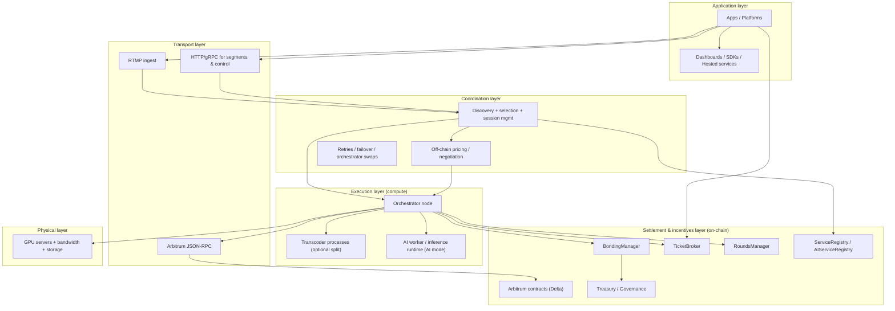
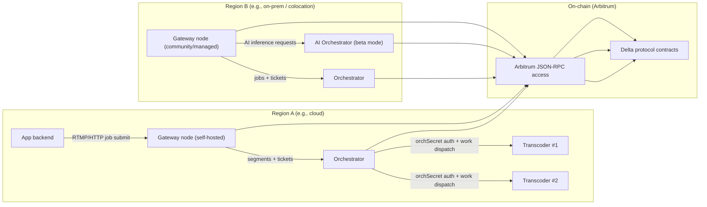
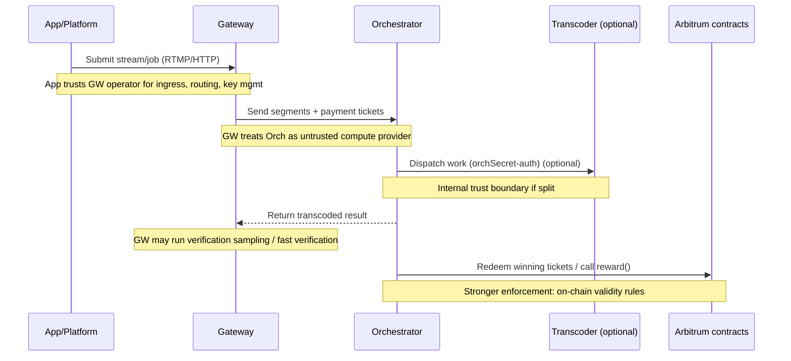
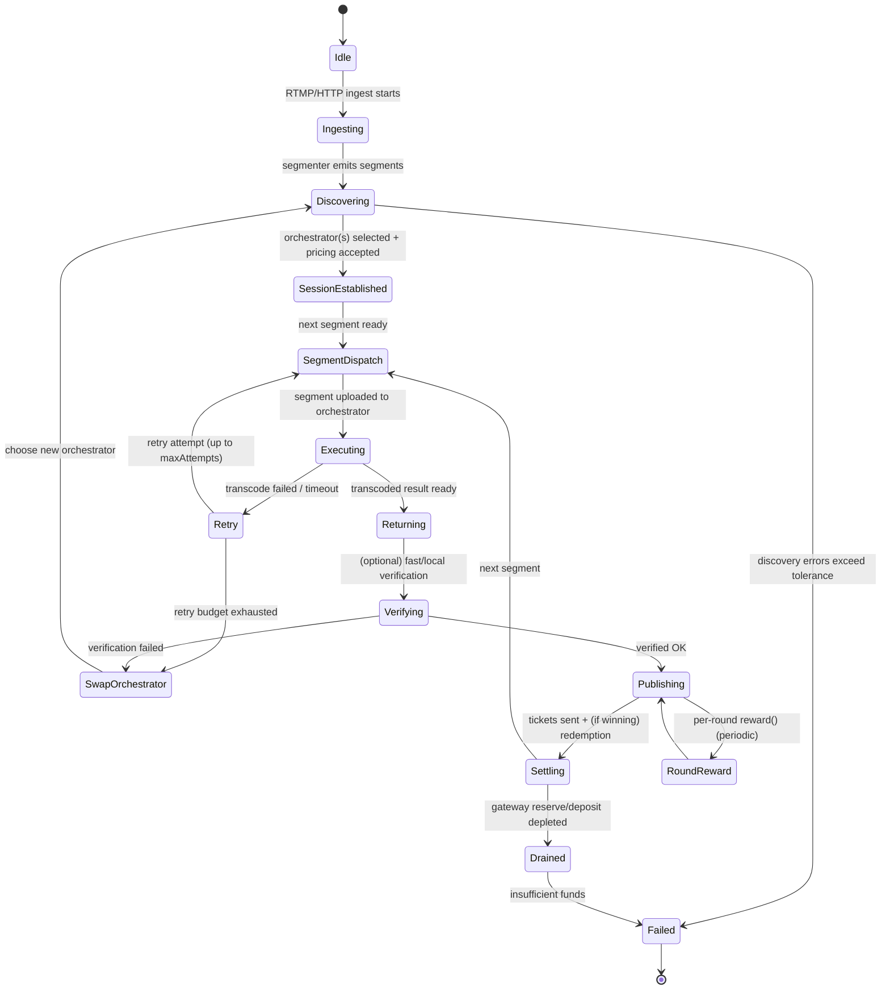
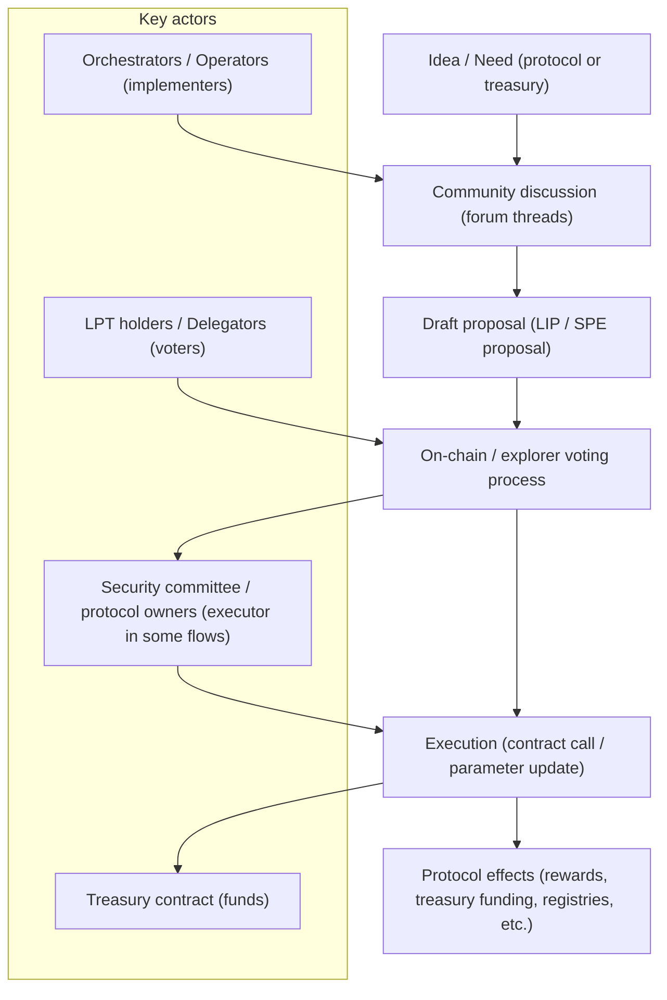

# Canonical six-part framework for describing the Livepeer system

## Executive summary

This report defines a canonical six-part framework for describing Livepeer as a complex distributed system with three tightly-coupled planes: an off-chain **compute plane** (GPU-backed transcoding and AI inference), an off-chain **market/coordination plane** (discovery, pricing, routing, retries), and an on-chain **incentive/settlement plane** (staking, rewards, ticket-based payments, governance, treasury). The framework is designed to be readable by engineers while remaining legible to product and stakeholder audiences, by separating *what the system is for*, *how it is layered*, *who participates and why*, *what must be trusted or verified*, *how work flows end-to-end*, and *how the rules change over time*. citeturn22view0turn31view1turn25search12

At a high level, Livepeer’s “network view” can be expressed as: **apps/platforms** submit compute jobs via **Gateway nodes**, which route work to **Orchestrator nodes**, and a **ticket-based micropayment system** settles fees; **Delegators** stake to Orchestrators and share in rewards/fees. citeturn22view0 The modern system also explicitly supports AI workloads (“Livepeer AI network”, currently described as beta in documentation) and introduces a distinct AI service registry and ports/roles for AI Gateways/Orchestrators. citeturn28search23turn28search16

The *most load-bearing architectural facts* for accurate description are:

- **Settlement & coordination are on entity["organization","Arbitrum One","layer-2 rollup"] mainnet (Delta-era contracts)**, with a defined set of protocol contracts (e.g., BondingManager, TicketBroker, RoundsManager, Treasury) published in official docs. citeturn31view1  
- **Gateways were previously called “Broadcasters”** in older nomenclature and code paths; this naming mismatch is explicitly called out in current documentation. citeturn32view0  
- **Work verification for non-deterministic GPU transcoding is treated as an evolving research/problem space**, and multiple sources emphasise that slashing is currently disabled/off (even though it remains part of the broader design vocabulary). citeturn23view0turn18view3turn18view2turn16search19  
- **Operational success can be measured with explicit node metrics** surfaced by the node software (segment success rate and latency, payment/ticket counters, gateway reserve/deposit, fast verification counters, orchestrator swaps, etc.). citeturn29view0  

The remainder of this report instantiates those facts in six complementary “views” and provides diagrams and tables to make the system explainable and reviewable.

## Mental model

Livepeer is best understood as **a decentralised “video compute” marketplace**: a demand-side agent (an app, platform, or operator) brings video or AI jobs; a supply-side agent (Orchestrators and their GPU capacity, optionally backed by separate Transcoder processes) performs work; and the protocol provides **routing, measurement, and payment primitives** to make that market viable at scale. citeturn22view0turn31view1turn26view2

### Purpose and core value propositions

From the official network overview, the system’s purpose is framed as enabling a “global decentralised group of orchestrators” that powers *video transcoding, distribution, and AI video processing* so developers and creators can build scalable applications. citeturn22view0 The operational decomposition implied by the same page is:

- Apps use endpoints exposed by **Gateway nodes**.
- Gateways route compute jobs to **Orchestrators**.
- A **ticket-based micropayment** system pays for completed work.
- **Delegators** stake to and accrue a portion of rewards/fees. citeturn22view0

Separately, Livepeer’s AI documentation defines “Livepeer AI” as a suite of generative AI capabilities (text-to-image, image-to-image, image-to-video, upscaling) integrated into the network’s infrastructure for node operators to earn revenue from GPU processing work. citeturn28search23

### Key use-cases

Two canonical use-cases can be described without relying on speculative/undocumented behaviour:

- **Video ingest → transcoding ladder → playback**: A Gateway can accept RTMP ingest and publish content; the docs give example `ffmpeg` commands for sending a test stream via RTMP to a Gateway. citeturn32view1  
- **AI inference via Gateway → Orchestrator**: The AI subsystem supports AI Gateways and AI Orchestrators, with explicit instructions for connecting to Arbitrum, configuring service URIs, and making inference requests. citeturn28search18turn28search16turn25search12  

(Distribution mechanisms beyond the Gateway’s published interfaces are not fully specified in the sources used here; where “distribution” is mentioned at a high level, it is treated as an outcome rather than a fully-specified protocol sub-layer.) citeturn22view0

### System boundaries

A practical boundary that keeps explanations precise is:

- **Inside Livepeer (protocol + network):**  
  off-chain node roles (Gateway, Orchestrator, Transcoder), pricing and retries, verification hooks, and the on-chain contracts that govern staking, rewards, ticket redemption, registries, and treasury/gov (Delta-era). citeturn27view0turn31view1turn29view0turn26view0  
- **Outside Livepeer (adjacent dependencies):**  
  standard video tooling/protocols (e.g., RTMP ingest as shown in docs), external RPC providers (or self-hosted nodes) for Arbitrum connectivity, and app-specific product layers (SDKs, dashboards, hosted services). citeturn32view1turn32view0turn25search12  

### Top-level success metrics

The node software exposes a rich metrics surface that can be repurposed into top-level KPIs. The following are *canonical* because they map to explicit metrics names/descriptions:

- **Reliability and throughput:** segment success rate; transcode failures; retries; number of active streams; stream start/end counters. citeturn29view0  
- **Latency and performance:** transcode time; overall transcoding latency (source segment emergence → all transcoded segments in manifest); upload/download times; realtime ratio metrics. citeturn29view0  
- **Market function / routing quality:** discovery error counts; orchestrator swaps mid-stream; current/max sessions; transcoder capacity/load when transcoders are attached to orchestrators. citeturn29view0  
- **Economic health at runtime:** ticket value sent/received; winning tickets received; redeemed value; gateway deposit/reserve; redemption errors; suggested gas price for redemption; advertised transcoding price per pixel. citeturn29view0turn22view1  
- **Verification posture (when enabled):** fast verification counts and failure counts. citeturn29view0turn23view0  

These metrics allow stakeholder-level questions (“Is it cheaper and reliable?”) to be tied to engineer-level observables (“success_rate”, “transcode_overall_latency_seconds”, “value_redeemed”, “gateway_reserve”, “ticket_redemption_errors”, etc.). citeturn29view0

## Layered stack

This section provides a “stack view” that makes Livepeer explainable as layered dependencies rather than a flat set of roles. It combines the on-chain protocol and off-chain network.

### Layer decomposition

The following six layers map well to Livepeer’s architecture and boundaries:

**Physical layer (compute & hardware)**  
GPU servers and networking that actually execute encode/inference. Orchestrator docs assume GPU access (e.g., Nvidia GPUs), and AI orchestration references GPU-backed containers and ports. citeturn25search4turn25search17turn26view2  

**Transport layer (media + RPC transport)**  
RTMP ingest to Gateways is first-class in the Gateway docs; orchestration requires access to an Arbitrum JSON-RPC endpoint (via provider or self-host). citeturn32view1turn32view0  

**Coordination layer (discovery, routing, sessioning)**  
Gateways “route” jobs to Orchestrators; node software includes explicit knobs for orchestrator selection behaviour (e.g., `selectRandFreq` for randomly selecting unknown orchestrators, session limits). citeturn22view0turn27view0turn14search10  

**Execution layer (transcoding & AI work)**  
Orchestrators perform transcoding and AI processing jobs; they may run transcoders in-process or connect to standalone transcoders using `orchSecret` and `orchAddr`. citeturn22view0turn26view3turn28search23  

**Settlement & incentives layer (on-chain accounting)**  
Delta-era contracts on Arbitrum include BondingManager, TicketBroker, RoundsManager, Treasury, registries, and governance contracts. Reward calls are Arbitrum transactions that distribute newly minted rewards to orchestrators and delegators. citeturn31view1turn26view0  

**Application layer (apps, SDKs, gateways-as-a-service)**  
Apps integrate via Gateway endpoints; Livepeer documentation explicitly supports developer SDKs and product layers (e.g., hosted APIs) as adjacent to the protocol. citeturn22view0turn14search25  

### Layer and interaction diagram



### Deployment topology example

The following topology is intended as a practical “reference deployment” for explanation and threat modelling. It is constrained to what the docs make explicit: Gateways expose ingest endpoints; orchestrators require Arbitrum RPC access; orchestrator↔transcoder can be split across machines via shared secrets; and AI orchestrators/gateways use distinct ports/flags. citeturn32view0turn26view3turn28search18turn25search17



### Component-to-layer mapping table

This table maps the requested components (broadcasters, orchestrators, transcoders, relays, smart contracts, clients) to the six-layer stack. “Broadcaster” is mapped to “Gateway” per current terminology. citeturn32view0turn22view0turn31view1

| Livepeer component | Primary layer | Secondary layers | Notes / dependencies |
|---|---:|---|---|
| Broadcaster (legacy term) / Gateway | Transport / Coordination | Application, Settlement | Docs explicitly note the Gateway was previously called the Broadcaster; Gateways route work and interact with ticket payments. citeturn32view0turn22view0 |
| Orchestrator | Execution | Coordination, Settlement | Performs transcoding/AI jobs; interacts with on-chain reward calls and ticket redemption. citeturn22view0turn26view0turn31view1 |
| Transcoder | Execution | Physical | Can be a separate process/machine connected via `orchSecret` and `orchAddr`. citeturn26view3 |
| Relay | Transport / Coordination | (varies) | Not described as a first-class role in current docs; discussed in historical/community design discussions as a segment relay/distribution concept. Treat as *unspecified* in the current canonical architecture unless your implementation uses it explicitly. citeturn17search11turn17search21turn17search13 |
| Smart contracts | Settlement & incentives | Governance | Delta-era contracts on Arbitrum include BondingManager, TicketBroker, RoundsManager, Treasury, registries, governance. citeturn31view1 |
| Clients (apps, SDK users) | Application | Transport | Apps integrate via Gateway endpoints; SDK layers are described in docs as an integration surface. citeturn22view0turn14search25 |

image_group{"layout":"carousel","aspect_ratio":"16:9","query":["Livepeer network architecture diagram gateway orchestrator ticket-based payment","Livepeer orchestrator transcoder architecture","Livepeer Confluence Delta protocol architecture diagram"],"num_per_query":1}

## Actor and incentive model

This section treats Livepeer as a mechanism design problem: a distributed market needs *roles, permissions, and economic exposure* to align compute supply with demand.

### Canonical actor set

The network-level documentation implies the minimal actor set: **apps/platforms**, **Gateway operators**, **Orchestrator operators**, and **Delegators**. citeturn22view0turn25search5 The protocol-level contract set adds governance and treasury actors (e.g., token holders voting; an operational “security committee” executing certain parameter changes, as described in treasury governance discussions). citeturn18view1turn22view3turn31view1

A useful canonical breakdown is:

- **Demand-side:** apps/platforms; gateway operators (often the same entity in self-hosted deployments). citeturn22view0turn32view0  
- **Supply-side:** orchestrators (and optional standalone transcoders providing additional capacity to an orchestrator). citeturn22view0turn26view3  
- **Capital-side:** delegators who stake and share in fees/rewards; governance participants. citeturn25search5turn31view1  
- **Protocol operators:** governance/treasury processes and parameter executors (“security committee” in the treasury context). citeturn18view1turn22view3  

### Revenue and cost flows

Two primary value streams exist:

1) **Fees (ETH-denominated) for work performed**, settled via ticket-based micropayments: Gateways send tickets; orchestrators redeem winning tickets; node metrics explicitly track ticket values sent/received, winning tickets, and redeemed value. citeturn22view0turn29view0turn22view1  

2) **Protocol rewards (inflationary LPT) distributed per round**, triggered operationally by orchestrator reward calls: docs state an active orchestrator “automatically call[s] reward in each round” submitting an Arbitrum transaction distributing newly minted rewards to itself and delegators, and that the transaction cost may exceed rewards for low-stake operators. citeturn26view0  

A third value sink/source is:

- **Treasury routing (a protocol-level “reward cut” to treasury)**: treasury governance discussions describe a `treasuryRewardCutRate` and a ceiling mechanism that can set the cut to zero once a ceiling is reached, then requires governance to re-enable. citeturn18view1turn19search9turn21view1turn22view3  

### Actor comparison table

| Actor | Role & core capability | Typical goal | Permissions (what they can do) | Economic exposure | Common risks / failure modes |
|---|---|---|---|---|---|
| App / platform | Generates demand; integrates video/AI features | Low-cost, reliable compute | Submit jobs to Gateways; select integration strategy | Pays fees indirectly (via Gateway tickets) | Vendor lock-in to a Gateway operator; QoS variance; payment misconfiguration |
| Gateway operator | Runs ingress + routing + payments | Provide stable interface to network (often for own app) | Accept RTMP ingest; route segments; create/send tickets; maintain deposit/reserve | ETH deposit/reserve depletion; operational infra costs | “Insufficient reserve”; payment creation errors; discovery errors; orchestrator swaps; stream failures citeturn29view0turn28search6 |
| Orchestrator operator | Runs node and provides compute directly or via transcoders | Earn fees and rewards; build reputation to attract stake | Register/serviceURI; set prices; redeem tickets; call reward | Costs: GPU + bandwidth + gas; revenue depends on stake and demand | Ticket redemption errors; capacity capping; verification failures; strategic underpricing / overpricing citeturn22view1turn14search10turn29view0 |
| Transcoder operator (standalone) | Provides compute capacity to an orchestrator | Earn a share of compute revenue (implementation-dependent) | Connect to orchestrator via `orchSecret`; transcode segments | Hardware + ops costs; revenue mediated through orchestrator | Fails startup test; disconnects; insufficient capacity; orchestration misconfig citeturn26view3turn27view0 |
| Delegator | Stakes to an orchestrator | Earn a portion of fees and rewards; governance influence | Choose orchestrator to stake to; vote (via governance systems) | Opportunity cost + lockups; exposure to governance outcomes | Concentration/“vampire” dynamics; governance capture; misinformation; slashing is currently described as not implemented citeturn25search5turn18view2turn18view3 |
| Treasury / governance participants | Decide protocol parameters and treasury allocations | Align incentives, fund public goods, sustain ecosystem | Propose/vote; set parameters; allocate treasury | Exposure to protocol success and governance legitimacy | Low participation; voting power concentration; capture risks citeturn18view2turn22view3turn18view1 |

### Economic flow diagram

The following diagram reflects what is explicitly described: ticket-based fees, per-round reward calls on Arbitrum, treasury reward cut/ceiling logic as discussed, and slashing shown as *currently disabled/off* (included because the user requested it, but flagged accordingly). citeturn22view0turn26view0turn21view1turn18view3turn16search19

```mermaid
flowchart TB
  App["App / Platform"] -->|job submit| GW["Gateway"]
  GW -->|segments + PM tickets| Orch["Orchestrator"]
  Orch -->|dispatch (optional)| Trans["Transcoder(s)"]

  subgraph Fees["Fee flow (ETH)"]
    GW -->|ticket value sent| TB["TicketBroker"]
    Orch -->|redeem winning tickets| TB
    TB -->|ETH credited/paid| Orch
    Orch -->|fee share (policy)| Del["Delegators (staked to Orch)"]
  end

  subgraph Rewards["Inflationary reward flow (LPT)"]
    Orch -->|reward() each round| BM["BondingManager / Minter logic"]
    BM -->|mint & distribute| Orch
    BM -->|mint & distribute| Del
    BM -->|treasuryRewardCutRate (if enabled)| Treas["Treasury"]
  end

  subgraph Slashing["Slashing (currently off)"]
    Slash["Slashing mechanism (disabled)"] -.->|economic penalty| Orch
    Slash -.->|economic penalty| Del
  end
```

## Trust and verification model

This view answers: *Where do we trust, where do we verify, and what happens when assumptions fail?*

### Trust boundaries

A canonical set of trust boundaries aligns with the system’s layered planes:

1) **App ↔ Gateway**: the app trusts the gateway operator for correct ingress/routing and key management (if any). Gateway metrics expose failure modes (payment errors, reserve/deposit, discovery errors). citeturn29view0turn32view0  

2) **Gateway ↔ Orchestrator**: the gateway treats orchestrators as potentially untrusted compute providers and relies on pricing, retries, and verification mechanisms to manage risk. The system explicitly tracks orchestrator swaps mid-stream and success rate. citeturn29view0turn23view0  

3) **Orchestrator ↔ Transcoder (optional split)**: when split, there is an explicit shared secret (`orchSecret`) used for transcoders to connect to the orchestrator, establishing an additional internal trust boundary. citeturn26view3  

4) **Off-chain ↔ On-chain**: the network relies on on-chain contracts to enforce payment validity (ticket redemption rules), staking/reward distribution, and governance rules; but execution results (transcoded bytes) are off-chain artefacts and require separate verification approaches. citeturn31view1turn23view0  

### Threat model

A non-exhaustive but practically relevant threat model, grounded in Livepeer’s own verification discussions and operational metrics, includes:

- **Incorrect or malicious transcoding outputs** (blank video, tampering, selective corruption). Livepeer research notes verification as a major challenge, especially for non-deterministic GPU transcoding. citeturn23view0turn23view2  
- **Economic exploitation in micropayments** (attempts to redeem more than expected; ticket manipulation; redemption bugs). The ecosystem has documented issues/vulnerabilities in TicketBroker random number generation inputs and signature format edge cases in the past. citeturn15search2turn15search10  
- **Sybil / identity games at the market layer** (many nodes, reputation manipulation, price wars). The verification roadmap explicitly discusses reputation (“trusted/untrusted orchestrators”) and random sampling to reduce predictability. citeturn23view0turn29view0  
- **Governance capture / low participation** (parameter changes that harm system goals). Governance discussions explicitly call out voting power concentration as a risk when participation is low. citeturn18view2  

### Verification mechanisms and what is actually enforced

It is important to separate:

- **Payment validity verification (strong, on-chain):** Ticket redemption requires satisfying contract conditions (ticket structure, signature verification, recipient randomness preimage). This is directly reflected in on-chain interfaces such as `redeemWinningTicket` and the inclusion of `recipientRandHash` / preimage. citeturn15search10turn15search2  

- **Work correctness verification (evolving, largely off-chain in current posture):** A key Livepeer research post describes that, as of the Streamflow upgrade, **slashing was disabled** in favour of *real-time statistical verification performed by broadcasters using a machine-learning-powered verifier*, and outlines a roadmap to “fast verification” (perceptual hashes like MPEG‑7 signatures) and “full verification” (slower dispute resolution with penalties). citeturn23view0turn23view3turn23view2  

- **Local / structural verification hooks in node software:** The CLI reference includes explicit verifier configuration (`verifierURL`, `verifierPath`) and a `localVerify` option (pixel count and signature verification). citeturn27view0  

Additionally, multiple sources (audit commentary, forum discussion) indicate that slashing is currently off/not implemented, which should be treated as a *current-state constraint* when describing “economic penalties”. citeturn18view3turn18view2turn16search19  

### Trust assumption change diagram

This diagram highlights points where the system must “switch models” (trusted → verified, off-chain → on-chain, etc.).



## Job lifecycle

This view describes the end-to-end “compute job” as a state machine. Because Livepeer’s compute is segment-oriented, the lifecycle is modelled at the level of a *stream session* and *per-segment processing*, with payment settlement occurring continuously via tickets and periodically via reward calls.

### Lifecycle narrative

A minimal, source-grounded job lifecycle is:

1) **Ingest and segmentation:** A Gateway receives an RTMP stream (docs provide explicit RTMP ingest examples) and produces segments to be processed. citeturn32view1turn29view0  

2) **Discovery and selection:** The Gateway selects an Orchestrator set according to the node software’s discovery logic; operational failures here appear as discovery errors and orchestrator swaps. citeturn29view0turn27view0  

3) **Price and session parameters:** Orchestrators advertise a price per pixel (Wei denominated) to gateways off-chain; orchestrators may auto-adjust price to compensate for ticket redemption overhead when gas is high. citeturn22view1  

4) **Segment dispatch and compute:** The Gateway uploads segments; the Orchestrator executes transcoding/AI compute locally or delegates to attached transcoder processes. citeturn22view0turn26view3turn29view0  

5) **Result return and verification:** Results are returned to the Gateway; verification may be performed (fast verification metrics exist and are explicitly named). Failures can trigger orchestrator swaps and retries. citeturn29view0turn23view0  

6) **Continuous settlement:** The Gateway sends probabilistic payment tickets; the Orchestrator redeems winning tickets and the system tracks redemption errors and redeemed value. citeturn29view0turn15search10turn15search2  

7) **Periodic reward accounting:** Each round, orchestrators may call `reward()` as an Arbitrum transaction distributing minted rewards to itself and its delegators. citeturn26view0  

### State machine diagram



### Events and transitions table

The table below maps concrete triggers to transitions using explicit config knobs/metrics where possible:

| Event / trigger | Observable evidence | Transition | Notes |
|---|---|---|---|
| Stream starts | `livepeer_stream_started_total` increments | Idle → Ingesting | Metrics are defined in node docs. citeturn29view0 |
| Discovery fails | `livepeer_discovery_errors_total` increments | Discovering → Failed | Exact selection algorithm is not fully specified in docs; treat as implementation detail. citeturn29view0turn27view0 |
| Segment transcode fails | `livepeer_segment_transcode_failed_total` / `livepeer_transcode_retried` | Executing → Retry | Retry budget controlled by `maxAttempts` (default 3). citeturn29view0turn27view0 |
| Orchestrator swap mid-stream | `livepeer_orchestrator_swaps` | Retry/Verifying → SwapOrchestrator | Swap behaviour is observable though exact policy is not fully specified. citeturn29view0 |
| Payment sent | `livepeer_tickets_sent`, `livepeer_ticket_value_sent` | Publishing → Settling | Deposit/reserve are explicitly surfaced per gateway. citeturn29view0 |
| Reserve/deposit depleted | `livepeer_gateway_reserve` / `livepeer_gateway_deposit` low/zero | Settling → Drained | Some community guides discuss splitting ETH into deposit + reserve for testing; treat exact sizing as operator-specific. citeturn29view0turn28search6 |
| Ticket redemption error | `livepeer_ticket_redemption_errors` | Settling → (degraded) | Redemption reliability impacts realised revenue for Orchestrator. citeturn29view0 |
| On-chain tx confirmation timeout | `txTimeout` (default 5 mins) | Settling/RoundReward → (retry/replace tx) | Transaction replacement knobs are defined in CLI options. citeturn27view0 |
| Per-round reward minted/distributed | orchestrator reward service enabled | Publishing ↔ RoundReward | Docs describe default auto reward calls per round on Arbitrum. citeturn26view0 |

## Governance and treasury

This view answers: *How do the system’s rules and parameters change, who decides, and what are the systemic risks?*

### Governance objects and “what can change”

Official contract address documentation lists governance-related contracts on Arbitrum mainnet (Delta): Governor, LivepeerGovernor (proxy/target), BondingVotes, and Treasury. citeturn31view1 This establishes that governance is not merely social; it is enacted through deployed contracts with published addresses.

Separately, the “community treasury” framing is explicitly described in a Livepeer blog post as introducing an on-chain treasury funded by protocol inflation (without changing token economics), governed by token holders, and including on-chain controls related to a “security committee”. citeturn22view3

### Treasury flows and parameterisation

Treasury governance discussions identify two parameters as especially important:

- `treasuryRewardCutRate`: a percentage cut of inflationary rewards routed into the treasury each round (draft discussion converged on lowering an initial 12.5% proposal to 10%). citeturn21view1turn18view1  
- `treasuryBalanceCeiling`: once the treasury balance exceeds a ceiling (discussed as 750,000 LPT), the cut can be set to zero, halting further automatic contributions until governance re-enables. citeturn21view1turn19search9turn18view1  

A 2025 proposal (“LIP 101”) explicitly states that the treasury stopped accumulating due to hitting the ceiling and resetting the reward cut to 0%, and proposes reactivating the cut (10%). It also states that “the security committee, as owners of the protocol” invokes the function to set the value per vote outcome—an important current centralisation/trust consideration. citeturn18view1  

### Governance process and decision flow

The following diagram is tailored to the sources available here (forum-driven proposals, votes, parameter execution by a committee/owners in at least some contexts, and treasury funding allocations).



### Risks to governance capture

The sources highlight several structurally important risks:

- **Low participation and voting power concentration** can reduce defence against hostile governance actions; this is explicitly discussed in community reflections on staking participation. citeturn18view2  
- **Executor centralisation (security committee / protocol owners)** introduces a trust dependency: even if voting is decentralised, execution may remain centralised in some paths (as described in LIP 101’s implementation section). citeturn18view1turn22view3  
- **Slashing as governance/security backstop is currently not implemented/off**, reducing the system’s ability to impose automatic economic penalties for certain classes of misbehaviour; this increases reliance on reputation, monitoring, and social/governance remedies. citeturn18view3turn18view2turn23view0turn16search19  

### Treasury allocation examples

The primary sources describe the treasury as intended for “strategic ecosystem projects”, “public goods”, and incentivising demand-side contributors (builders) rather than only node operators. citeturn18view1turn22view3 Translating that intent into concrete, explainable categories (without asserting specific real-world allocations unless explicitly documented) yields a canonical set of example buckets:

- **Protocol safety and maintenance:** security reviews, audits, incident response tooling (supported by the explicit emphasis on protocol security and governance processes). citeturn18view1turn22view3  
- **Demand generation public goods:** developer UX improvements, documentation, “shots on goal” for adoption (explicitly described as a motivation for sustainable funding). citeturn22view3turn18view1  
- **Ecosystem infrastructure:** shared gateway infrastructure (community gateways, onboarding paths) as discussed in ecosystem proposals and gateway funding concepts. citeturn28search12turn22view0  

Where allocations depend on additional governance frameworks (e.g., SPE-specific procedures), treat those mechanics as *implementation-specific* unless your architecture documentation is explicitly targeting that governance subsystem.

