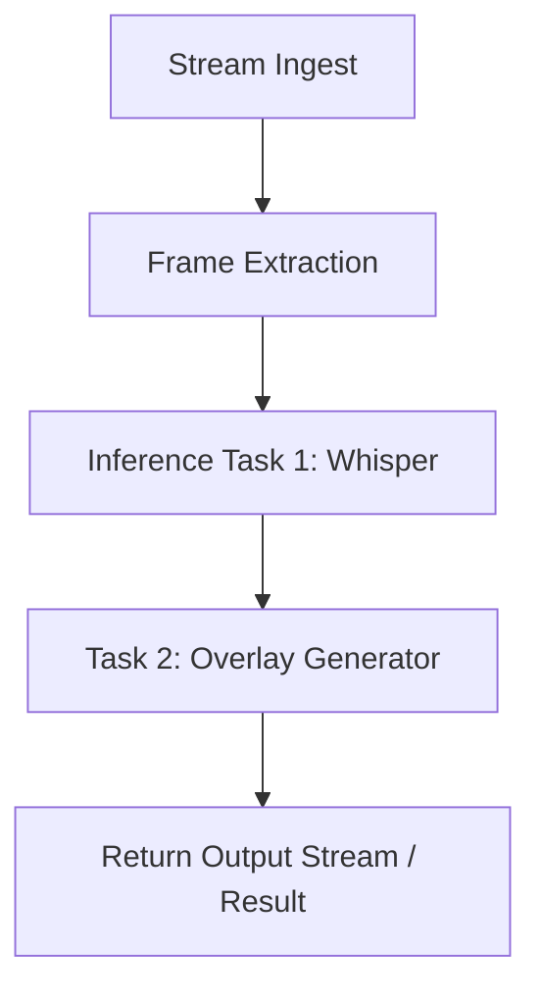

import { PreviewCallout } from '/snippets/components/domain/SHARED/previewCallouts.jsx'
import { DynamicTable } from '/snippets/components/layout/table.jsx'

<PreviewCallout />

Livepeer AI Pipelines let you run customizable, composable video inference jobs across distributed GPU infrastructure. Powered by the Livepeer network and supported by off-chain workers like ComfyStream, the system makes it easy to deploy video AI at scale.

## In a nutshell

- **Pipelines** are one or more inference tasks (e.g. Whisper, style transfer, detection) run in sequence on video frames.
- **Gateways** route jobs to compatible **Orchestrators** and **workers**; the protocol handles payment and coordination.
- **BYOC** (Bring Your Own Compute) and **ComfyStream** are two ways to run or extend pipelines with your own models and nodes.

## Use cases

- Speech-to-text (Whisper)
- Style transfer or filters (Stable Diffusion)
- Object tracking and detection (YOLO)
- Video segmentation (segment-anything)
- Face redaction or blurring
- BYOC (Bring Your Own Compute)

## What is a pipeline?

An AI pipeline consists of one or more tasks executed in sequence on live video frames. Each task may:

- Modify the video (e.g. add overlays)
- Generate metadata (e.g. transcript, bounding boxes)
- Relay results to another node

Livepeer handles stream ingest, frame extraction, and job dispatching. Nodes run the actual inference.



## Architecture

### Gateway and workers

- **Orchestrators** queue inference jobs and run (or delegate to) workers.
- **Workers** subscribe to task types (e.g. whisper-transcribe) and execute them.
- **Gateways** route jobs from clients to compatible nodes. This is off-chain; the protocol (Arbitrum) handles payments and rewards.

### Worker types

<DynamicTable
  headerList={["Type", "Description", "Example models"]}
  itemsList={[
    { "Type": "Whisper Worker", "Description": "Speech-to-text inference", "Example models": "whisper-large" },
    { "Type": "Diffusion Worker", "Description": "Image-to-image or overlay generation", "Example models": "sdxl, controlnet" },
    { "Type": "Detection Worker", "Description": "Bounding box or class prediction", "Example models": "YOLOv8" },
    { "Type": "Pipeline Worker", "Description": "Chained tasks via ComfyStream or custom", "Example models": "custom-pipeline" }
  ]}
/>

## Pipeline definition format

Jobs can be JSON-based task objects. Example:

```json
{
  "streamId": "abc123",
  "task": "custom-pipeline",
  "pipeline": [
    { "task": "whisper-transcribe", "lang": "en" },
    { "task": "segment-blur", "target": "faces" }
  ]
}
```

Workers can accept:

- JSON-formatted tasks via the Gateway
- Frame-by-frame gRPC (low latency)
- Result upload via webhook

## Bring your own compute (BYOC)

You can use your own GPU nodes to serve inference tasks:

1. Clone [ComfyStream](https://github.com/livepeer/comfystream) or implement the processing API.
2. Add plugins for Whisper, ControlNet, or other models.
3. Register your node with the gateway (and optionally on-chain).

See [BYOC](./byoc) for a full setup guide.

## See also

- [BYOC](./byoc) — Run your own AI workers and register with the network
- [ComfyStream](./comfystream) — ComfyUI-based pipelines and Gateway integration
- [Livepeer AI (overview)](../livepeer-ai/overview-ai-on-livepeer) — Product overview and use cases
- [Network technical architecture](/about/network/technical-architecture) — Gateway, Orchestrator, and protocol

## Resources

- [ComfyStream GitHub](https://github.com/livepeer/comfystream)
- [Livepeer Studio AI docs](https://livepeer.studio/docs/ai)
- [Forum: example pipelines](https://forum.livepeer.org/t/example-pipelines)
- [Explorer](https://explorer.livepeer.org) — Network and node stats
