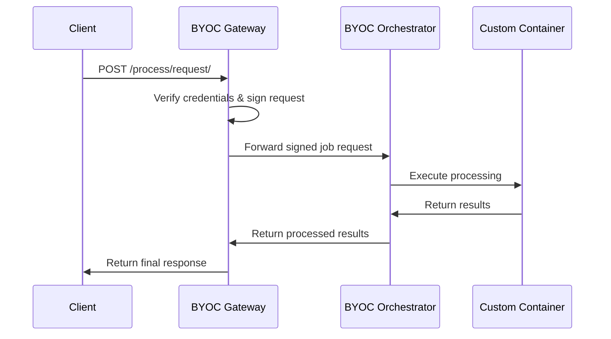
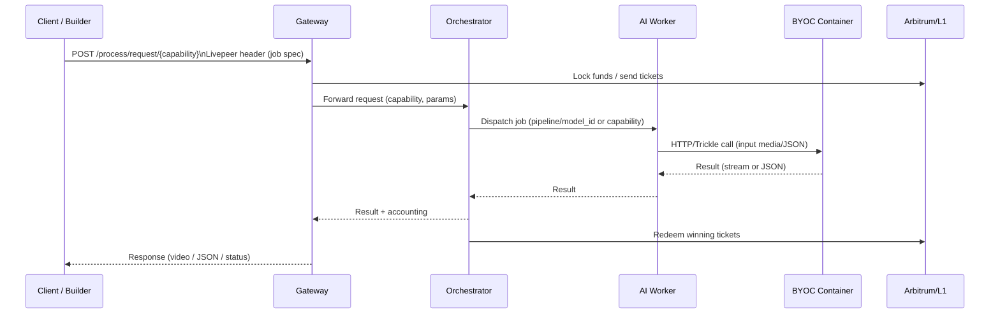

import { PreviewCallout } from '/snippets/components/domain/SHARED/previewCallouts.jsx'

<PreviewCallout />


# AI Workers

AI workers are run when you start a node with the -aiWorker flag. They can run in two modes:

Combined with Orchestrator (-orchestrator -aiWorker): The orchestrator also runs AI processing locally
Standalone AI Worker (-aiWorker only): Connects to a remote orchestrator via gRPC

Key Points:
AI workers are the component that actually runs Docker containers starter.go:1345-1349
Gateways only route requests and handle payments; they don't run containers byoc.go:25-35
BYOC containers are managed by the AI worker's Docker manager
For CPU models, you don't need the -nvidia flag starter.go:1296-1300

# BYOC (Bring Your Own Container) Overview

BYOC is Livepeer's Generic Processing Pipeline that allows you to run custom Docker containers for media processing tasks on the Livepeer network. It enables you to bring your own processing capabilities while integrating with Livepeer's infrastructure for job distribution, payment, and orchestration.

## Key Points

- **BYOC is NOT just any Docker container** - it must implement Livepeer's processing API
- **It runs on Orchestrator nodes**, not on-chain or locally by default
- **You need an Orchestrator** to process BYOC jobs in the network
- **It interacts with Gateways** for job submission and with Orchestrators for execution

---

## Architecture

### Core Components

BYOC consists of two main server types:

1. **BYOCGatewayServer** - Handles job submission from clients [1](#0-0)
2. **BYOCOrchestratorServer** - Manages job processing on orchestrators [2](#0-1)

### Job Flow



### HTTP Endpoints

**Gateway endpoints:**

- `/process/request/` - Submit new processing jobs [3](#0-2)

**Orchestrator endpoints:**

- `/process/request/` - Process jobs from gateways [4](#0-3)
- `/process/token` - Get job tokens
- `/capability/register` - Register new capabilities
- `/capability/unregister` - Unregister capabilities [5](#0-4)

---

## Interaction with Livepeer Network

### With Gateways

Gateways act as the entry point for BYOC jobs:

1. Receive job requests from clients
2. Verify credentials and signatures
3. Find suitable orchestrators with the required capability
4. Forward signed requests to orchestrators
5. Return results to clients [6](#0-5)

### With Orchestrators

Orchestrators handle the actual processing:

1. Receive signed job requests from gateways
2. Validate signatures and payments
3. Execute jobs in registered containers
4. Manage capacity for different capabilities
5. Return processed results [7](#0-6)

### Do You Need an Orchestrator?

**Yes**, you need an orchestrator to:

- Process BYOC jobs in the network
- Handle payments and ticket validation
- Manage container lifecycle and capacity
- Register capabilities with the network

Without an orchestrator, you can only submit jobs but they won't be processed.

---

## Container Requirements

### What Can You Put in the Container?

Your container must:

1. Implement Livepeer's processing API endpoints
2. Handle the specific job types you register for
3. Be compatible with Docker runtime
4. Expose appropriate HTTP endpoints

### Container Lifecycle

The container is managed by the orchestrator:

- Pulled and started when jobs are submitted
- Stopped when idle (after 3 minutes by default) [8](#0-7)
- Health-checked every 5 seconds [9](#0-8)
- Restarted on failure (up to 3 times)<cite repo="livepeer/go-livepeer" path="ai/worker/docker.go" line="431" />

### Where It Runs

BYOC containers run:

- **On Orchestrator nodes** (not on-chain)
- In Docker environment managed by Livepeer
- With GPU allocation if required [10](#0-9)
- With local volume mounts for models [11](#0-10)

---

## Examples

### Job Submission Example

```bash
# Submit a job to the gateway
curl -X POST http://gateway:8935/process/request/ \
  -H "Content-Type: application/json" \
  -H "X-Job-Request: <base64-encoded-job-request>" \
  -d '{"input": "data"}'
```

### Job Request Structure

The job request includes:

- `capability` - The processing capability required
- `parameters` - Job-specific parameters (JSON)
- `timeout_seconds` - Maximum execution time
- Payment information and signature [12](#0-11)

### Configuration Example

Orchestrators can be configured with BYOC support:

```bash
livepeer -orchestrator -transcoder -acceptRemoteAIWorkers
```

The BYOC server is automatically initialized when starting an orchestrator [13](#0-12) .

---

## Network Integration

### Capability Registration

Orchestrators register their processing capabilities:

- External capabilities are registered via API
- Capacity is tracked per capability
- Jobs are routed to capable orchestrators [14](#0-13)

### Payment Integration

BYOC integrates with Livepeer's payment system:

- Uses ticket-based micropayments
- Validates sender signatures
- Debits fees for processing [15](#0-14)

### Security

- All requests are signed by the gateway
- Orchestrators verify signatures before processing
- TLS is used for network communication [16](#0-15)

---

## Notes

- BYOC was introduced in v0.8.5 as the "Generic Processing Pipeline" [17](#0-16)
- It's designed for custom media processing beyond standard transcoding
- The system reuses much of Livepeer's existing infrastructure for payments and orchestration
- Containers are managed similarly to AI worker containers but for general processing tasks

Wiki pages you might want to explore:

- [Architecture (livepeer/go-livepeer)](/wiki/livepeer/go-livepeer#1.1)
- [AI Workers (livepeer/go-livepeer)](/wiki/livepeer/go-livepeer#2.6)

---

---

## BYOC Concepts

There are two closely related concepts people call BYOC:

1. **AI BYOC** – External Containers behind AI Workers

   - AI Orchestrators define models in an aiModels.json file. For external containers, a model entry includes fields like url, capacity, and optional token. The AI Worker forwards inference requests to that URL instead of a built-in ai-runner container.
   - The external container must behave like a normal model container (REST API, /health endpoint, expected HTTP semantics and error codes).
     Reference: [livepeer/ai-runner](https://github.com/livepeer/ai-runner)

2. **Protocol BYOC** – Generic Processing Pipeline
   - Introduced in go-livepeer as the Generic Processing Pipeline (a.k.a. Bring Your Own Container) with follow-up BYOC fixes in later releases.
   - Exposes a generic POST /process/request/{capability} path on Gateways that forwards requests to Orchestrators, which then route to arbitrary HTTP services/containers advertising that capability.
     Reference: [livepeer/go-livepeer](https://github.com/livepeer/go-livepeer) releases (BYOC-related PRs) and go-livepeer source.

Both approaches reuse the same economic rails as other Livepeer AI workloads:

- Gateways lock funds and send probabilistic tickets,
- Orchestrators redeem tickets and earn fees,
- Delegators stake on Orchestrators that provide these capabilities.

## Architecture

Actors

- **Client / Builder app** – Calls the Gateway via the AI/Video API or POST /process/request/{capability}.
- **Gateway (AI or generic)** – Routes jobs, holds funds, discovers suitable Orchestrators, sends/receives tickets, enforces pricing and max EV.
- **Orchestrator (AI)** – Registered on-chain with an AI service URI; advertises pipelines/models (and potentially external containers) via aiModels.json.
- **AI Worker / Runner** – Runs model containers or forwards to external containers (BYOC).
- **BYOC Container(s)** – Your Docker images (models, agents, business logic) exposed over HTTP. For AI BYOC these are “external containers”; for generic BYOC they implement named capabilities like pulse.

For reference implementations and examples:

- [livepeer/go-livepeer](https://github.com/livepeer/go-livepeer) – core node implementation, including BYOC / Generic Processing Pipeline.
- [Roaring30s/livepeer-byoc](https://github.com/Roaring30s/livepeer-byoc) – minimal example showcasing a pulse capability container and capability registration.
- [livepeer/ai-runner](https://github.com/livepeer/ai-runner) – containerized Python application used as the base for AI inference containers.
- [livepeer/pytrickle](https://github.com/livepeer/pytrickle) – Python implementation of the HTTP Trickle protocol used to connect real-time AI/video pipelines to the Livepeer stack.

## Request Flow

For AI external containers, the Gateway still calls the Orchestrator as usual; the Orchestrator’s AI Worker routes requests to your url instead of an internal model container.

For generic BYOC, the Gateway calls POST /process/request/{capability}; the Orchestrator routes that capability to your container (example: pulse in livepeer-byoc).



## Interactions

#### Gateways

- AI Gateways are funded on-chain (deposit + reserve) and connect to the AI service registry using flags such as -aiServiceRegistry, -network, -ethUrl, -ethAcctAddr, -maxTotalEV, etc.
- For BYOC they:
  - Discover Orchestrators that advertise a given pipeline/model or capability.
  - Pay via probabilistic tickets as with any AI job.
  - Forward generic jobs through POST /process/request/{capability} for BYOC pipelines.

Reference docs:

- Livepeer AI Orchestrator model docs: Download AI Models.
- Go SDK / protocol references: Go SDK docs.

#### Orchestrators

- Must be a top Orchestrator on the main network and run a separate AI Orchestrator with its own AI service URI to earn AI job fees.
- Configure models and containers in aiModels.json. For external containers they set url, capacity, and token and ensure the HTTP API behaves like ai-runner containers (including a /health endpoint).
- For BYOC capabilities (generic pipeline):
  - Run go-livepeer with BYOC/Generic Processing Pipeline enabled.
  - Use a registration mechanism (e.g. the register-capability container in livepeer-byoc) to advertise capabilities like pulse.

## Build a BYO Container

For AI BYOC / External Containers (documented today):

1. Write your service

   - Container runs whatever stack you like (Python/FastAPI, Node, etc.).
   - It exposes a model-like HTTP API: Livepeer AI Worker will call your url the same way it calls its internal containers and expect the same response format & HTTP error semantics.【citeturn19view0】

2. Implement /health

   - Worker will hit /health at startup; it must return a 200 OK if the container is ready.【citeturn19view0】

3. Container management

   - You can manage containers however you like (single GPU node, K8s, Docker Swarm, Nomad, custom scripts). The only requirement is that the url behaves as a pass-through to the actual model containers.【citeturn19view0】

4. Wire it into aiModels.json
   - Add a model entry with pipeline, model_id, price_per_unit, and url, capacity, token for your BYOC container.【citeturn19view0】
   - Restart Orchestrator + AI Worker so they read the updated config.

For generic BYOC capability containers (as in livepeer-byoc):

1. Example architecture
   - The sample repo spins up: gateway, orchestrator, a simple pulse capability container (Flask app), and a register-capability container to register that capability with the Orchestrator.【citeturn8view1】
2. HTTP contract

   - Clients call the Gateway’s /process/request/{capability} endpoint with a Livepeer header containing a base64-encoded JSON job description (fields like run, capability, timeout, params).【citeturn8view1】
   - The Orchestrator forwards the call to your container, which returns a JSON status or payload (for pulse, just a “healthy” status).【citeturn8view1】

3. Build & run
   - You can follow the docker-compose.yml in that repo as a template: one service for your capability, one to register it, and a local Gateway + Orchestrator pair for testing.【citeturn8view1】

For streaming / rich AI pipelines, Lisbon talks describe pytrickle (Python implementation of the HTTP Trickle protocol) as the standard way to stream data between Livepeer and arbitrary containers, enabling more complex video/agent workloads.【fileciteturn6file10L32-L75turn12file10L41-L52】 The pytrickle GitHub repo documents the library; it is the recommended building block for advanced BYOC pipelines.【citeturn12search4turn12search6】

## Examples & Repo's

Repos to study:

- livepeer/go-livepeer – core implementation; BYOC lives in the “Generic Processing Pipeline” and related BYOC issues/PRs.【citeturn17search0】
- Roaring30s/livepeer-byoc – minimal end-to-end example of the BYOC pipeline (pulse capability, registration container, local gateway/orch).【citeturn8view1】
- livepeer/ai-runner – base image used by AI Workers; useful to mirror API behaviour when building BYOC containers.【citeturn18search8】
- ai-spe/pytrickle – Python HTTP Trickle library used to bridge containers and Livepeer stack for more advanced BYOC use cases.【citeturn12search4turn12search6】

Talks where BYOC is explained:

- Peter Schrödl – Live in Lisbon Summit 2025: explains pytrickle and “bring your own container” wiring between containers and the gateway/orchestrator stack (≈4:44–7:15).【fileciteturn6file10L32-L75】
- Define & Dane Lisbon session: describes how the BYOC shift let them deploy Unreal/game-like pipelines onto the network.【fileciteturn6file8L51-L55】
- Doug & Shannon Lisbon sessions: frame BYOC / “bring your own container or dockerized model” as core to Livepeer AI’s value proposition.【fileciteturn6file11L46-L48turn6file7L41-L44】
