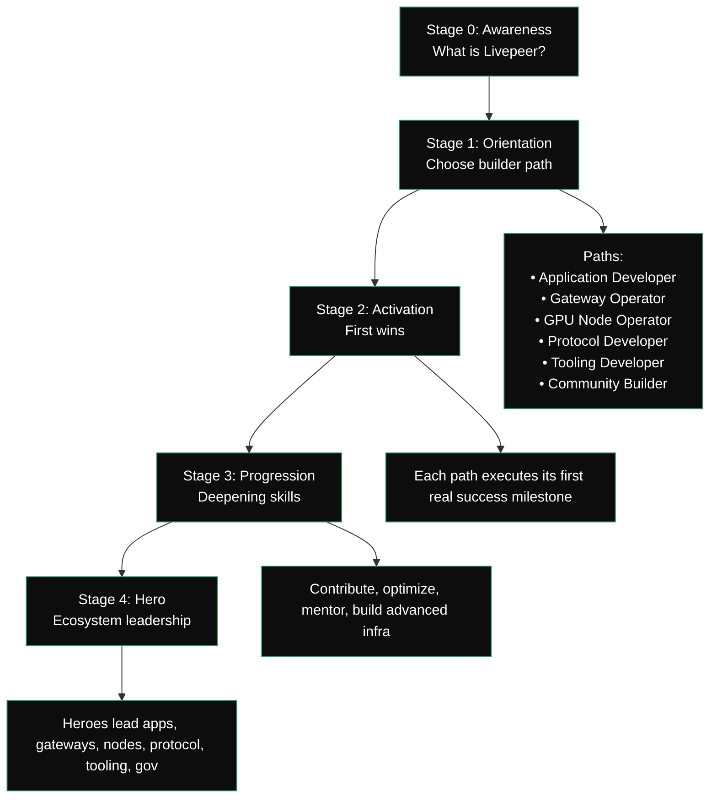

import { PreviewCallout } from '/snippets/components/domain/SHARED/previewCallouts.jsx'

<PreviewCallout />

| Stage | Name        | Purpose                                             | Outcomes                                                                           |
| ----- | ----------- | --------------------------------------------------- | ---------------------------------------------------------------------------------- |
| 0     | Awareness   | Understand Livepeer, compute model, ecosystem roles | Clarity on Protocol → Network → Apps; basic mental model                           |
| 1     | Orientation | Identify which builder persona fits their goals     | Path chosen: App Dev, Gateway Operator, GPU Node, Protocol Dev, Tooling, Community |
| 2     | Activation  | Perform first meaningful action in chosen path      | "First win" achieved: app built, node deployed, contract written, tool created     |
| 3     | Progression | Increase expertise and contribution                 | Contributions, optimizations, mentoring, advanced workflows                        |
| 4     | Hero        | Become a leader/steward in the ecosystem            | Operate at scale, publish tools, author proposals, run programs                    |

