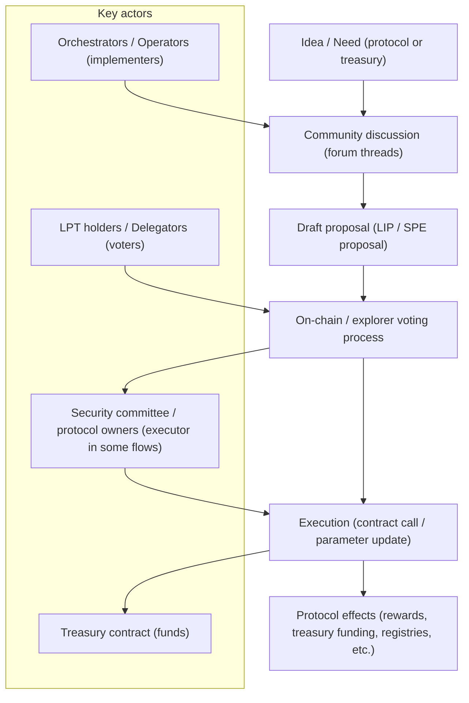

import { ComingSoonCallout } from '/snippets/components/domain/SHARED/previewCallouts.jsx'

<ComingSoonCallout />

How do the system’s rules and parameters change, who decides, and what are the systemic risks?

Livepeer is a community-governed protocol. LPT token holders propose and vote on [Livepeer Improvement Proposals](https://github.com/livepeer/LIPs) (LIPs) and funding proposals via the on-chain treasury. 
{/* For example, when the Livepeer Foundation or an SPE needs funding, a proposal is put forth and token holders must vote to approve it on-chain.  */}
The process ensures that major decisions (protocol upgrades, treasury spending) have community consensus. 

{/* A [forum post](https://forum.livepeer.org/t/3153) emphasizes that even with new advisory boards recommending projects, **_“Token Holders still have to vote on each SPE… onchain.”_**

This guarantees that ultimate power resides with the wider community of stakeholders.
 */}

## Governance objects and “what can change”
Official contract address documentation lists governance-related contracts on Arbitrum mainnet (Delta): Governor, LivepeerGovernor (proxy/target), BondingVotes, and Treasury. 
 This establishes that governance is not merely social; it is enacted through deployed contracts with published addresses.

Separately, the “community treasury” framing is explicitly described in a Livepeer blog post as introducing an on-chain treasury funded by protocol inflation (without changing token economics), governed by token holders, and including on-chain controls related to a “security committee”. 

### Treasury flows and parameterisation
Treasury governance discussions identify two parameters as especially important:

- `treasuryRewardCutRate`: a percentage cut of inflationary rewards routed into the treasury each round (draft discussion converged on lowering an initial 12.5% proposal to 10%). 
- `treasuryBalanceCeiling`: once the treasury balance exceeds a ceiling (discussed as 750,000 LPT), the cut can be set to zero, halting further automatic contributions until governance re-enables. 
A 2025 proposal (“LIP 101”) explicitly states that the treasury stopped accumulating due to hitting the ceiling and resetting the reward cut to 0%, and proposes reactivating the cut (10%). It also states that “the security committee, as owners of the protocol” invokes the function to set the value per vote outcome—an important current centralisation/trust consideration. 

### Governance process and decision flow
The following diagram is tailored to the sources available here (forum-driven proposals, votes, parameter execution by a committee/owners in at least some contexts, and treasury funding allocations).

Key actors

Idea / Need (protocol or treasury)

Community discussion (forum threads)

Draft proposal (LIP / SPE proposal)

On-chain / explorer voting process

Execution (contract call / parameter update)

Protocol effects (rewards, treasury funding, registries, etc.)

LPT holders / Delegators (voters)

Orchestrators / Operators (implementers)

Security committee / protocol owners (executor in some flows)

Treasury contract (funds)

### Risks to governance capture
The sources highlight several structurally important risks:

- Low participation and voting power concentration can reduce defence against hostile governance actions; this is explicitly discussed in community reflections on staking participation. 
- Executor centralisation (security committee / protocol owners) introduces a trust dependency: even if voting is decentralised, execution may remain centralised in some paths (as described in LIP 101’s implementation section). 
- Slashing as governance/security backstop is currently not implemented/off, reducing the system’s ability to impose automatic economic penalties for certain classes of misbehaviour; this increases reliance on reputation, monitoring, and social/governance remedies. 

### Treasury allocation examples
The primary sources describe the treasury as intended for “strategic ecosystem projects”, “public goods”, and incentivising demand-side contributors (builders) rather than only node operators. 
 Translating that intent into concrete, explainable categories (without asserting specific real-world allocations unless explicitly documented) yields a canonical set of example buckets:

- Protocol safety and maintenance: security reviews, audits, incident response tooling (supported by the explicit emphasis on protocol security and governance processes). 
- Demand generation public goods: developer UX improvements, documentation, “shots on goal” for adoption (explicitly described as a motivation for sustainable funding). 
- Ecosystem infrastructure: shared gateway infrastructure (community gateways, onboarding paths) as discussed in ecosystem proposals and gateway funding concepts. 
Where allocations depend on additional governance frameworks (e.g., SPE-specific procedures), treat those mechanics as implementation-specific unless your architecture documentation is explicitly targeting that governance subsystem.